# Electron Helloworld
**Easy intro to Electron (on Raspberry)**  
General procedures apply to other platforms...  
  
**Visual Tutorial HowTo**  
  
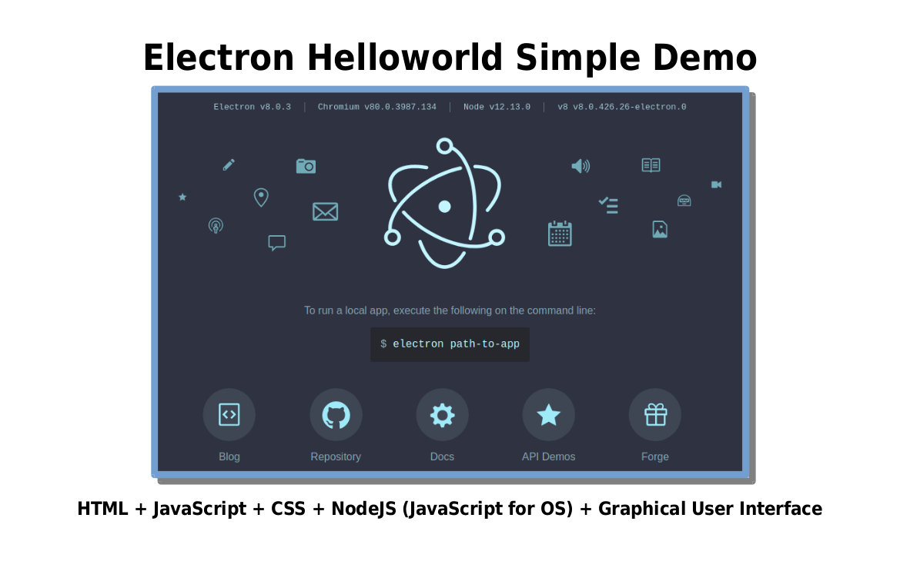
  
---
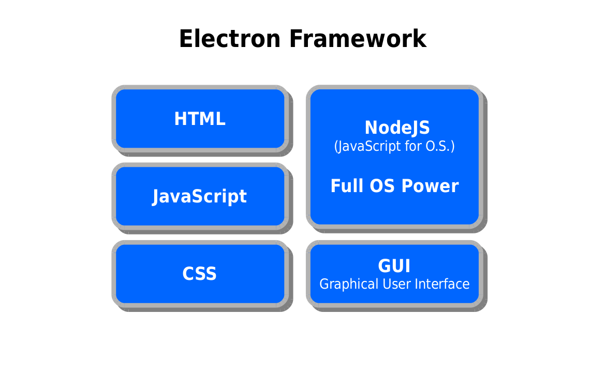
  
---
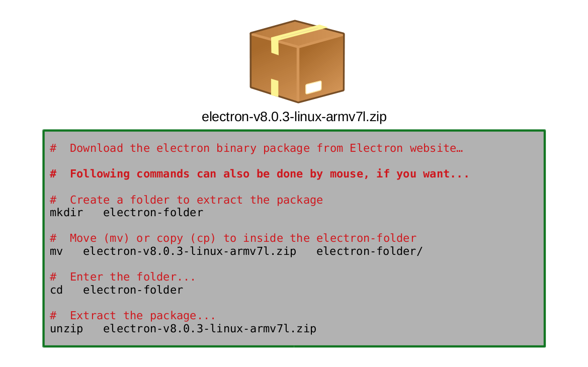
  
---
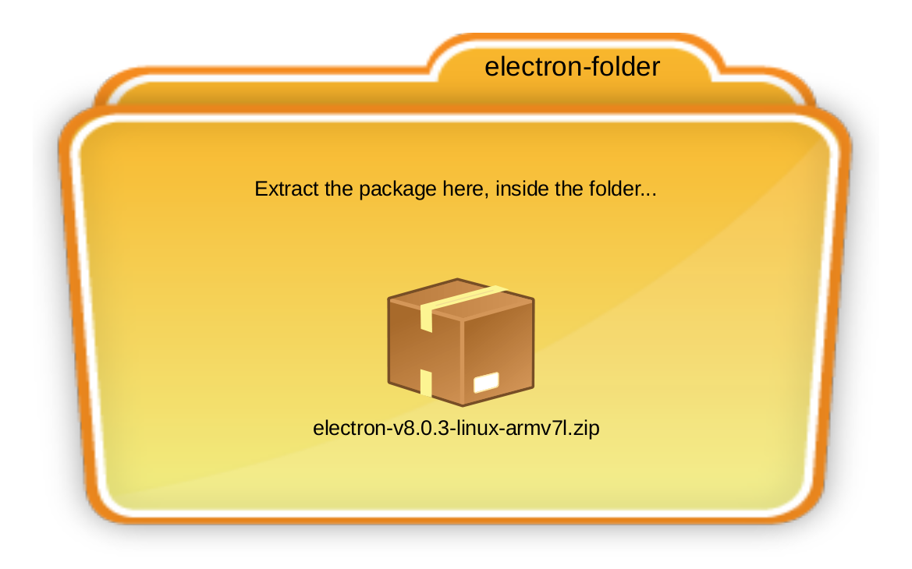
  
---
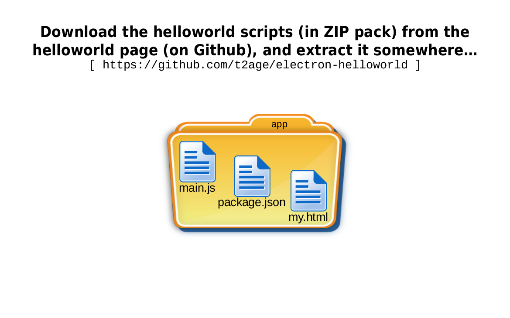
  
---
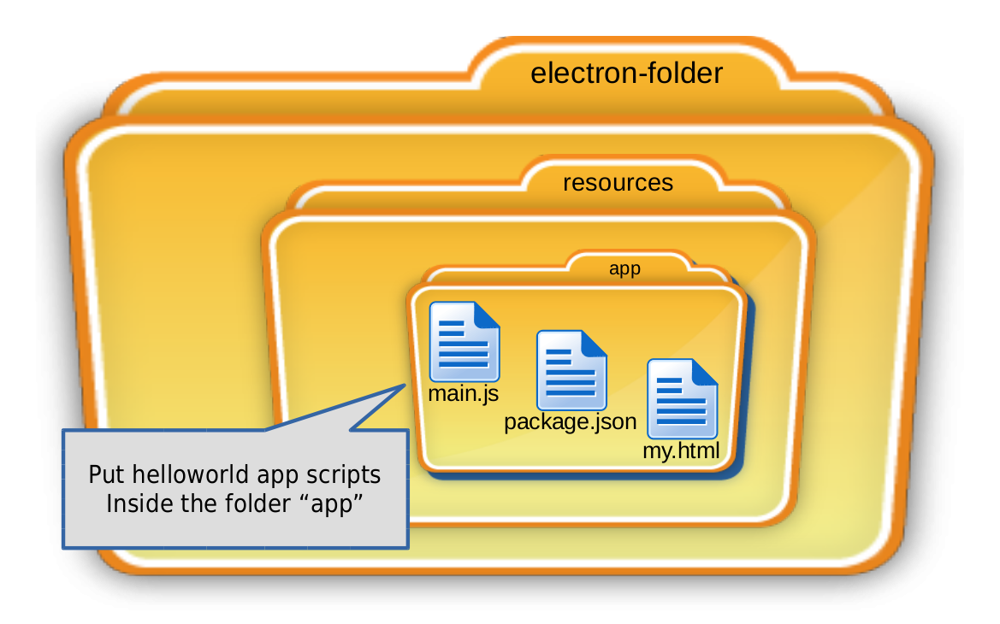
  
---
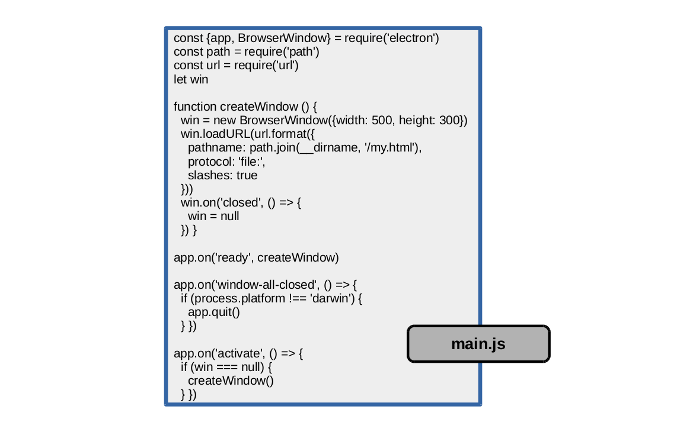
  
---
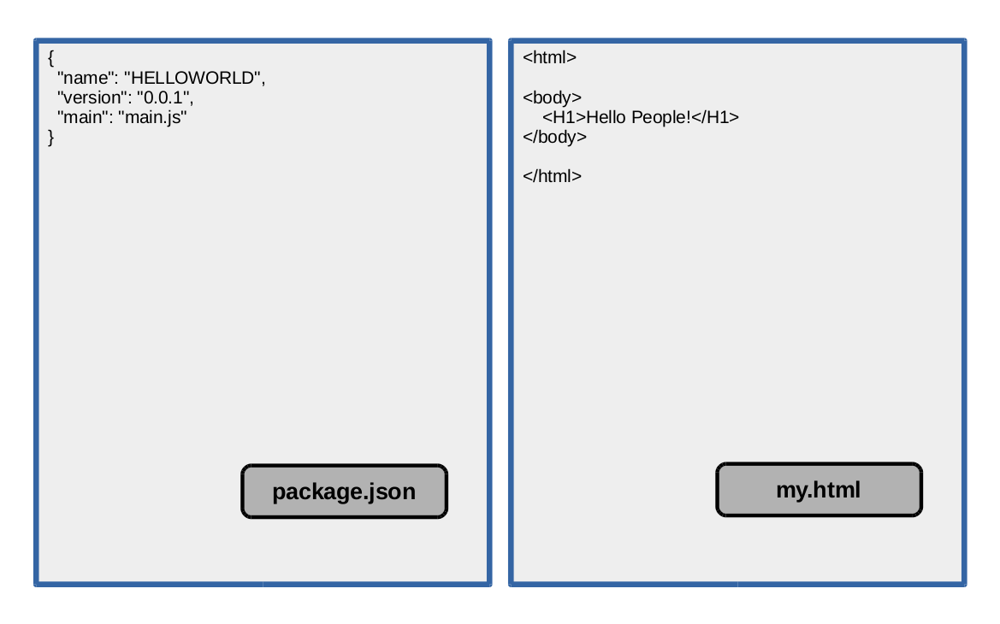
  
---
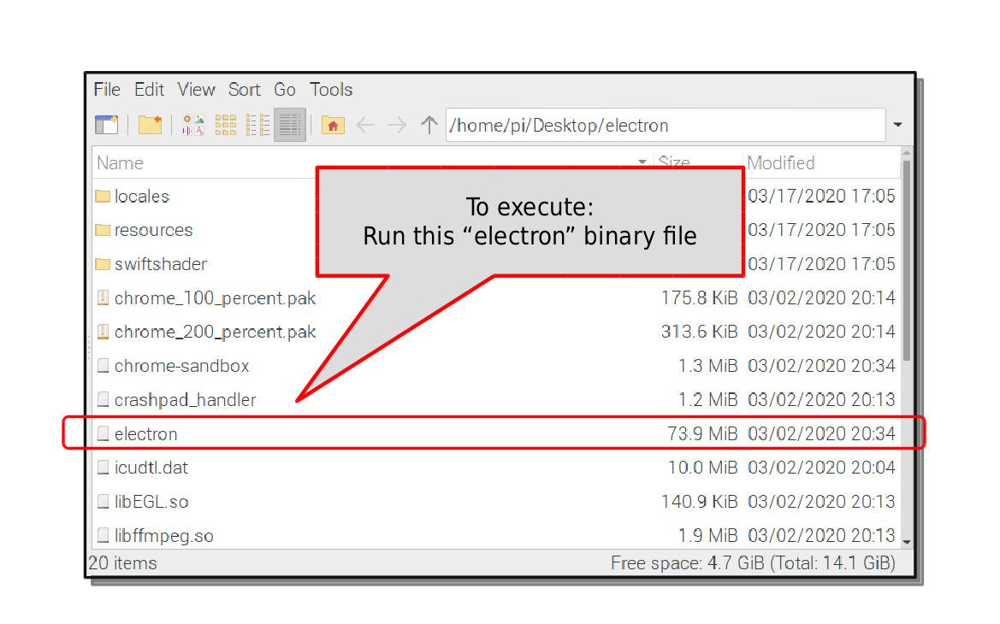
  
---
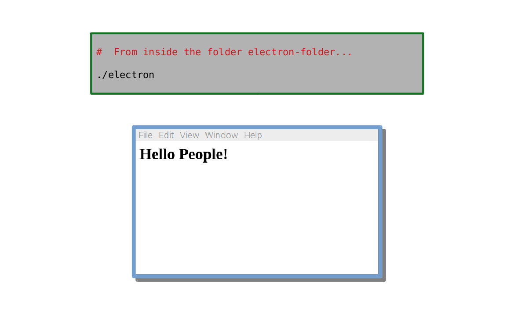
  
---
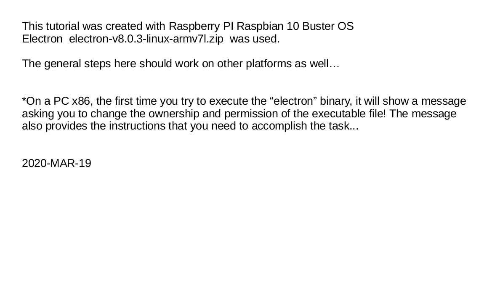  
  
---
  
**HOWTO in Screenshot Sequence**  
Take look inside folder SCREEN-ANIME, for howto in screenshot sequence anime style...  
  
  
 .
